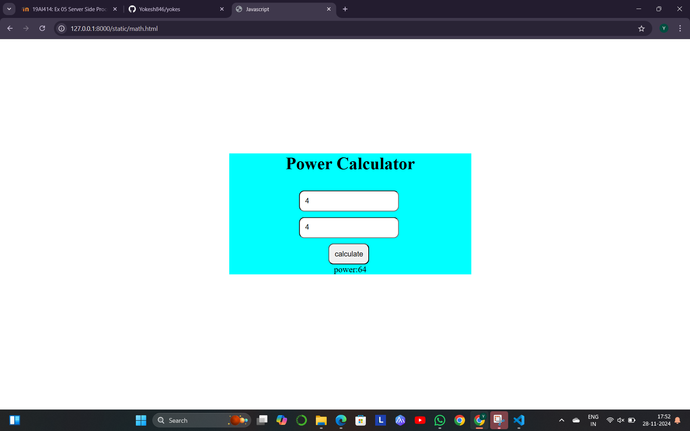

# Ex.05 Design a Website for Server Side Processing
## Date:28.11.2024

## AIM:
 To design a website to calculate the power of a lamp filament in an incandescent bulb in the server side. 


## FORMULA:
P = I<sup>2</sup>R
<br> P --> Power (in watts)
<br> I --> Intensity
<br> R --> Resistance

## DESIGN STEPS:

### Step 1:
Clone the repository from GitHub.

### Step 2:
Create Django Admin project.

### Step 3:
Create a New App under the Django Admin project.

### Step 4:
Create python programs for views and urls to perform server side processing.

### Step 5:
Create a HTML file to implement form based input and output.

### Step 6:
Publish the website in the given URL.

## PROGRAM :
```
math.html
<!DOCTYPE html>
 <html lang="en">
 <head>
 <meta charset="UTF-8">
 <meta name="viewport" content="width=device-width, initial-scale=1.0">
 <title>Javascript</title>
 <style>
 input{
 border-radius: 10px;
            padding: 10px;
            margin-top: 10px;
            margin-right:5px ;
        }
        body{
            margin-top: 15%;
        }
        h1{
            color:black;
            font-size: 40pz;
            
        }
        form{
            background-color: aqua;
            width: 450px; ;
        }
    </style>
    <script>
        function pow(){
            var x=document.getElementById("a").value
            var y=document.getElementById("b").value
            document.getElementById('r').innerText="power:" +x*x*y
            
        
        }
    </script>
 </head>
 <body >
    <br>
    
    <center>
        <form >
        
        <h1>Power Calculator  </h1>
     
    <input type="text" placeholder="Enter intensity" id="a">
    <br>
    <input type="text" placeholder="Enter resistance" id="b">
    <br>
    <input type="button" value="calculate" onclick="pow()"><br>
    <label id="r"></label>
 </form>
    </center>
 </body>
 </html>
```

## SERVER SIDE PROCESSING:
```
 <script>
        function pow(){
            var x=document.getElementById("a").value
            var y=document.getElementById("b").value
            document.getElementById('r').innerText="power:" +x*x*y
            
        
        }
    </script>
```

## HOMEPAGE:


## RESULT:
The program for performing server side processing is completed successfully.
